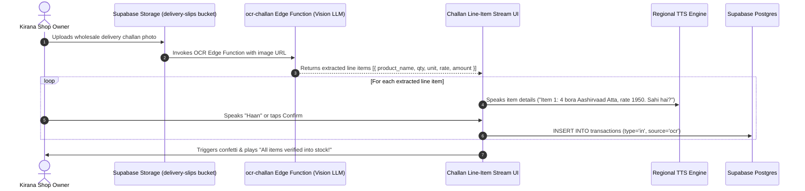
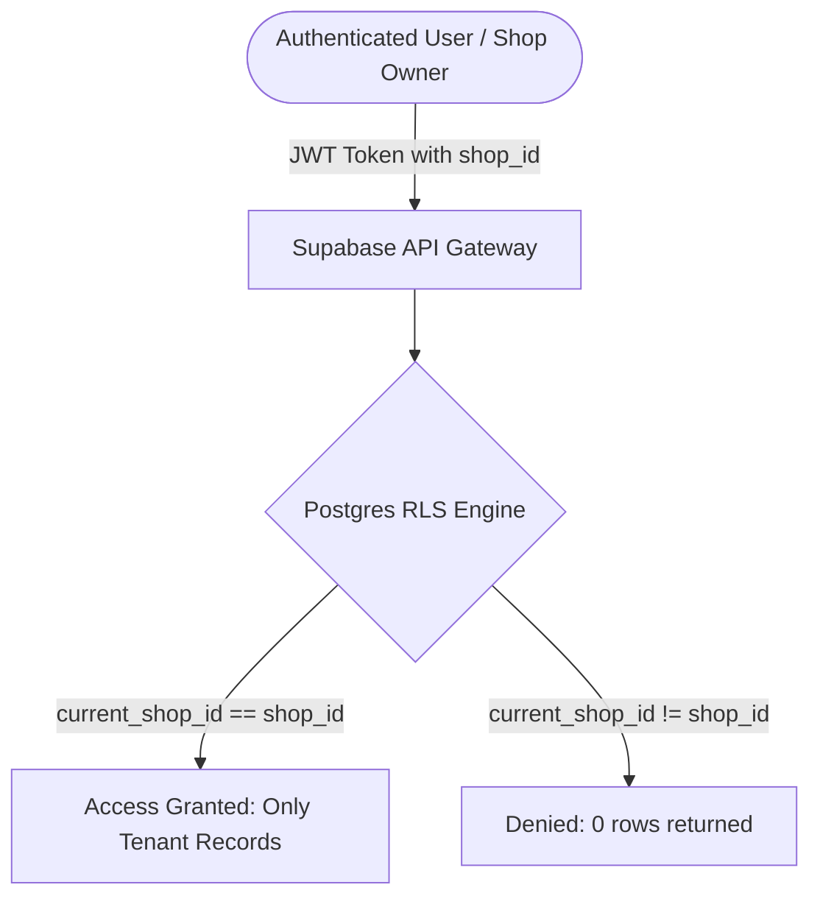

# GenRob System Architecture & Technical Specification

GenRob is a voice-first, Supabase-native inventory management operating system engineered specifically for Indian small businesses (kirana stores, grain merchants, provision traders, wholesalers).

---

## 1. End-to-End Voice Pipeline Architecture

The primary interaction paradigm avoids typing and English menus. The shop owner speaks naturally at the shop counter in regional or code-mixed vernacular (*Hindi, Telugu, Hinglish, Teluglish*).

```mermaid
sequenceDiagram
    autonumber
    actor Owner as Kirana Shop Owner
    participant Mic as Web Audio API / Mic
    participant STT as Web Speech API (Client) / Whisper Edge Function
    participant NLU as NLU Parser Edge Function (Deno)
    participant PGV as Supabase Postgres (pgvector match_product_aliases)
    participant UI as Visual Voice Confirmation Card
    participant DB as Supabase Postgres (transactions table)
    participant TRG as Postgres Triggers (Stock Balance & Alerts)
    participant RT as Supabase Realtime Channel
    participant TTS as Regional TTS SpeechSynthesis

    Owner->>Mic: Speaks trade entry ("5 bora Aashirvaad atta aaya 2100 mein")
    Mic->>STT: Audio Stream / Live Audio Spectrum
    STT-->>UI: Realtime interim transcription & Audio Waveform
    STT->>NLU: Final transcript + shop language context
    NLU-->>PGV: Extracted Intent & Entities: { product_query: "Aashirvaad atta", qty: 5, unit: "bora", price: 2100, direction: "in" }
    PGV-->>UI: Hybrid pgvector cosine match: Product ID, 1 bora = 50kg, Base Qty = 250kg
    UI->>Owner: Displays Color-Coded Confirmation Card (Confidence: 96% Green, Item, Total)
    Owner->>UI: Voice Confirmation ("Haan, sahi hai") or Tap "Pukka Karein"
    UI->>DB: INSERT INTO transactions (shop_id, product_id, type='in', qty=5, unit='bora', price=2100, source='voice')
    DB->>TRG: BEFORE/AFTER INSERT Trigger (fn_sync_product_stock)
    TRG->>TRG: Converts 5 bora to 250kg; Updates products.current_stock
    TRG->>TRG: Checks reorder_threshold; Auto-evaluates alerts table
    TRG->>RT: Broadcasts postgres_changes event on products, transactions, alerts
    RT-->>UI: Realtime updates stock counters and low-stock badge instantly
    UI->>TTS: Speaks regional affirmation ("5 bora Aashirvaad atta stock mein darj ho gaya")
```

---

## 2. Challan Photo OCR + Voice Confirmation Pipeline



---

## 3. WhatsApp Voice-Note Ingestion Pipeline

```mermaid
sequenceDiagram
    autonumber
    actor Owner as Kirana Owner via WhatsApp
    participant WA as WhatsApp Cloud API Webhook
    participant WH as whatsapp-webhook Edge Function
    participant STT as Whisper STT API
    participant NLU as nlu-parser Edge Function
    participant DB as Supabase Postgres (Triggers + RLS)

    Owner->>WA: Sends 4-second voice note ("Do tin sunflower oil bika hotel wale ko")
    WA->>WH: Webhook POST (audio media object)
    WH->>STT: Transcribes audio blob
    STT-->>WH: "दो टिन सनफ्लावर ऑइल बिका होटल वाले को"
    WH->>NLU: Parses vernacular intent
    NLU-->>WH: { product: "Fortune Sunflower Oil", qty: 2, unit: "tin", direction: "out" }
    WH->>DB: Inserts transaction; Postgres trigger recalculates stock
    WH->>WA: Replies with WhatsApp interactive message: "✅ Stock updated: 2 tins Sunflower Oil deducted"
```

---

## 4. Row Level Security (RLS) & Multi-Tenant Model

Every query, mutation, and realtime publication is scoped to `shop_id`.



### RLS Policies Enforced on ALL Tables:
- `shops`: Only the owner with matching `id = current_shop_id()` can select or update.
- `users`: Members can only view fellow workers of their own shop.
- `products`: Select, Insert, Update, Delete restricted by `shop_id = current_shop_id()`.
- `transactions`: Strict tenant scoping.
- `alerts`: Scoped to `shop_id = current_shop_id()`.
- `customers` & `khata_ledger`: Scoped to `shop_id = current_shop_id()`.
- `suppliers` & `purchase_orders`: Scoped to `shop_id = current_shop_id()`.

---

## 5. Trade Vocabulary Engine (pgvector & Trigrams)

Indian small businesses use informal trade vernacular that varies by state, mandi, and community:
- **Hindi / Urdu**: *Bora (बोरा), Katta (कट्टा), Pipa (पीपा), Peti (पेटी), Patti (पट्टी), Paav (पाव - 250g), Aadha (आधा - 500g), Dedh (डेढ़ - 1.5), Dhaai (ढाई - 2.5)*
- **Telugu**: *Basta (బస్తా), Dabba (డబ్బా), Petti (పెట్టి), Gampa (గంప), Soni (సోని)*

### Hybrid Matching Strategy in `match_product_aliases`:
1. **Semantic Vector Cosine Distance**: `1 - (product_aliases.embedding <=> p_query_embedding)` using pgvector `vector(384)`. Handles semantic conceptual matches (e.g. "roti ka powder" → "Aashirvaad Atta").
2. **Trigram Text Similarity**: `similarity(pa.alias_text, p_query_text)` using `pg_trgm`. Handles phonetic spelling variations and misspellings in regional script or Latin transliteration.
3. **Adaptive Feedback Learning**: When an owner confirms a voice correction, the system automatically inserts the new nickname into `product_aliases`, continuously improving accuracy.

---

## 6. Future Architecture Roadmap (Document Only — Do Not Build)

### 1. Supplier Marketplace
- Direct digital bridge connecting kirana store owners with FMCG distributors (ITC, HUL, Britannia, Adani Wilmar) and local mandi grain wholesalers.
- Automated RFQ (Request for Quotation) generation triggered when Postgres predictive reorder identifies that stock will exhaust in $\le 3$ days.

### 2. B2B Inventory Sharing Across Unrelated Kiranas
- Federated inter-shop inventory visibility within a 2-kilometer micro-radius.
- Allows neighboring kiranas to pool high-demand stock shortages (e.g. borrow 1 bag of Sona Masoori rice from adjacent shop instead of turning away a paying customer).
- Built on cryptographic escrow and zero-knowledge ledger verification.

### 3. Monetization Model
- **Freemium Voice Tier**: Up to 300 voice transactions/month free for micro-kiranas.
- **Pro Kirana Subscription**: ₹299/month for unlimited voice entries, WhatsApp bot integration, and multi-staff cashier access.
- **Fintech Credit Line**: Working capital loans underwritten via live Khata ledger turnover data and rolling daily inventory velocity.

### 4. On-Device Regional Machine Learning (Edge AI)
- Local WebAssembly (Wasm) + WebGPU execution of quantized Whisper-Tiny and multilingual MobileLLM models.
- Allows 100% offline voice recognition and structured parsing even in deep underground wholesale mandi basements without cellular data connectivity.
